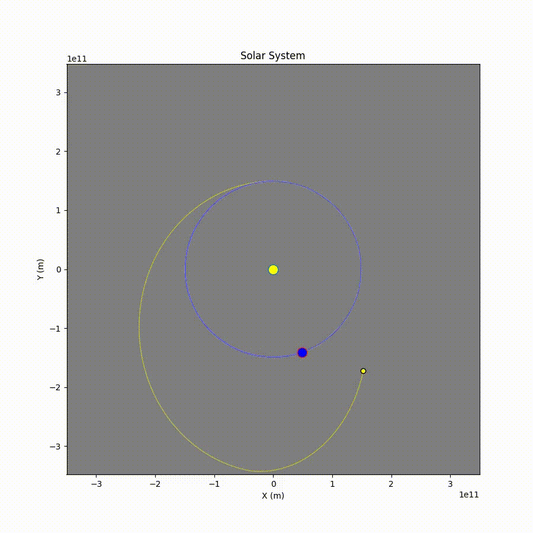

# Slingshot Optimizer


A gravitational slingshot (gravity assist) simulator and trajectory optimizer for spacecraft missions. Given a probe launched from Earth's orbit, the optimizer finds the optimal velocity impulse (ΔV) at aphelion to maximize the probe's orbital energy after the flyby, simulating a real Earth gravity assist maneuver.

Built as a final project for an **Introduction to Optimization** course.


## Overview

When a spacecraft performs a gravity assist, it passes close to a planet and exchanges momentum with it. This simulation models that interaction in a simplified 2D solar system using Newtonian gravity, then uses numerical optimization to find the best ΔV to apply at the probe's aphelion (the furthest point from Earth in its initial orbit) to set up the flyby.

The optimization runs in **two sequential stages**:

1. **Distance minimization**: uses SLSQP to find a ΔV that brings the probe close to Earth (flyby candidate).
2. **Energy maximization**: starting from the distance result, uses Differential Evolution to maximize the probe's specific orbital energy (relative to the Sun) while enforcing the flyby proximity constraint found in stage 1.


## Features

- N-body gravitational simulation using `scipy.solve_ivp` (RK45)
- Configurable solar system via `params.yaml`: enable/disable any planet, adjust masses, positions, and orbital parameters
- Two-phase optimizer: SLSQP for distance minimization, Differential Evolution for energy maximization
- Automatic initial guess computation based on probe-target geometry at aphelion
- Event-driven simulation split: runs until aphelion, applies ΔV, then continues
- Animated visualization of trajectories with `matplotlib`
- Simple initial-position plot for quick configuration checks


## Project Structure

```
slingshot-optimizer/
├── main.py             # Entry point and simulation mode selector
├── params.yaml         # Simulation and celestial body configuration
├── requirements.txt    # Python dependencies
└── slingshot/
    ├── __init__.py
    ├── celestial_body.py   # CelestialBody class: state, orbital mechanics helpers
    ├── config.py           # YAML loader and config validation
    ├── universe.py         # N-body physics, ODE setup, simulation runner
    ├── optimizer.py        # Two-phase optimizer (SLSQP + Differential Evolution)
    └── visualizer.py       # Matplotlib animation and static plots
```


## Installation

**Requirements:** Python 3.10+ (match-case syntax is used in `main.py`)

```bash
git clone git@github.com:JMarcosCGomes/slingshot-optimizer.git
cd slingshot-optimizer
pip install -r requirements.txt
```


## Usage

Select a simulation mode in `main.py` by setting `simulation_option`:

```python
simulation_option = "PLOT"                # Plot initial positions only
simulation_option = "UNTIL_APHELION"      # Simulate up to aphelion, then animate
simulation_option = "FULL_SIMULATION"     # Simulate with a manually chosen ΔV
simulation_option = "OPTIMIZED_SIMULATION" # Run optimizer, then animate result
```

Then run:

```bash
python main.py
```

For `FULL_SIMULATION`, set the desired impulse manually:

```python
chosen_dv = [dvx, dvy]  # in m/s
```


## Configuration

All simulation parameters live in `params.yaml`.

**Simulation settings:**

| Parameter | Description |
|---|---|
| `max_phase1_duration` | Maximum duration for the pre-aphelion simulation segment (seconds) |
| `max_step` | Maximum ODE solver time step (seconds) |

**Optimizer settings:**

| Parameter | Description |
|---|---|
| `max_dv` | Maximum allowed ΔV magnitude (m/s) |
| `pre_opt_flyby_years` | Duration of the post-aphelion segment used during optimization (years) |

**Main settings:**

| Parameter | Description |
|---|---|
| `post_opt_flyby_years` | Duration of the post-aphelion segment used in the final animated simulation (years) |

**Celestial bodies** are defined as a list. Each entry supports:

| Field | Description |
|---|---|
| `name` | Body name |
| `active` | Whether to include it in the simulation |
| `role` | `fixed`, `planet`, `target`, `probe`, or `satellite` |
| `mass` | Mass in kg |
| `radius` | Radius in meters |
| `color` | Matplotlib color string |
| `orbit_radius` | Orbital radius from `wir` body (meters) |
| `angle_deg` | Initial angular position (degrees) |
| `wir` | "Who it's related to": the body it orbits |
| `is_orbiting` | Whether to auto-calculate orbital velocity |

The simulation requires exactly one body of each role: `fixed` (the Sun), `target` (the gravity assist body), and `probe`.


## How the Optimizer Works

The optimization splits the trajectory in two:

**Phase 1: run to aphelion:** The probe is simulated from launch until it reaches aphelion relative to Earth (detected via a zero-crossing event on the radial velocity dot product). This is the natural moment to apply a ΔV burn. The initial guess for the optimizer is computed automatically from the probe-target geometry at this point.

**Phase 2: apply ΔV and continue:** A ΔV impulse `[dvx, dvy]` is added to the probe's velocity at aphelion. The simulation then runs for an additional `pre_opt_flyby_years` years during optimization.

**Stage 1 — minimize distance to target (SLSQP):**

$$\min_{\Delta v} \left(\frac{d_{min}}{10^6}\right)^2$$

subject to: $|\Delta v| \leq \Delta v_{max}$, no collision with target.

**Stage 2 — maximize specific orbital energy (Differential Evolution):**

$$\max_{\Delta v} \left(\frac{v_f^2}{2} - \frac{\mu_{Sun}}{r_f}\right)$$

subject to: $|\Delta v| \leq \Delta v_{max}$, no collision, $d_{min} \leq d_{flyby}^* + \epsilon$

where $d_{flyby}^*$ is the minimum distance found in Stage 1, and $\epsilon$ is a small margin. This forces Stage 2 to stay near the flyby solution found in Stage 1.

Direct energy maximization often converges to non-flyby local optima. The two-stage approach constrains the search space to physically meaningful gravity-assist trajectories. Differential Evolution is used in Stage 2 due to the multimodal nature of the energy landscape.


## Dependencies

| Package | Version |
|---|---|
| numpy | 2.3.3 |
| scipy | 1.16.2 |
| matplotlib | 3.10.6 |
| PyYAML | 6.0.1 |


## Results

